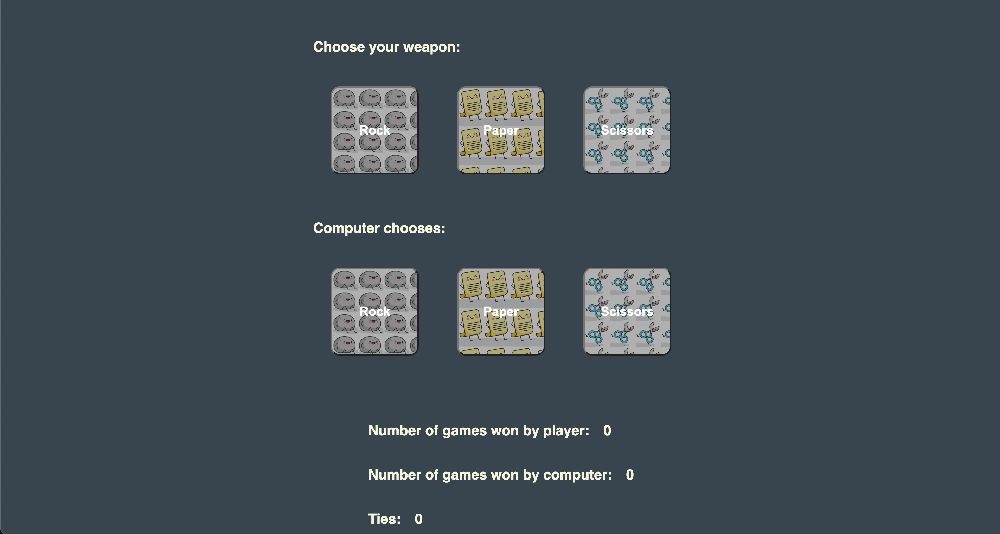

# Rock Paper Scissors

Rock Paper Scissors is the first javascript project I created for the Odin Project. The code is very rudimentary and written completely in plain HTML/CSS/Javascript. [Working demo here](https://implexrr.github.io/rock-paper-scissors/). Since this is the first ever JS project that I created from scratch and on my own, I felt like I learnt a lot about the HTML/CSS/JS stack creating this project.



## Installation

To create a copy of the project, type the following command into your terminal:

```bash
git clone git@github.com:implexrr/rock-paper-scissors.git
```

Note that the stylesheet and script link paths in this project will need to be changed in order for the CSS/JS files to render properly.

## Things I learnt creating the project

- HTML
  - Buttons
  - Links
  - Asset linking
- CSS
  - Basic class & ID selectors
  - Keyframe animations
  - Box shadows
- Javascript
  - Dynamically manipulation of DOM elements
  - Set timeouts
- General Programming
  - Conditional statements
  - Loops
## Usage

Not sure how to play the [game](https://implexrr.github.io/rock-paper-scissors/)? Read more about the game [here](https://en.wikipedia.org/wiki/Rock_paper_scissors).

## Contributing

Pull requests are welcome. For major changes, please open an issue first
to discuss what you would like to change.

Please make sure to update tests as appropriate.

## License

[MIT](https://choosealicense.com/licenses/mit/)
